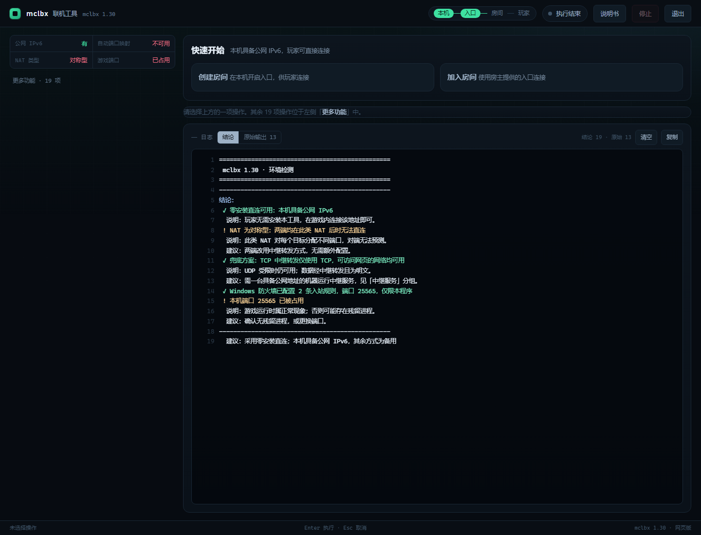

# mclbx

我的世界 Java 版联机工具。房主开一次房间，把地址或邀请发给朋友：房主有公网地址时，朋友在游戏里「多人游戏 → 直接连接」填上就能进；没有时退到软件入口或中继转发。

Windows 端是单个可执行文件，纯 Go 编写，免安装、免注册账号、不上传任何数据。



## 能做什么

- **三条通道**：公网入口、软件入口、中继转发，可同时开启，玩家从任意一条进来。
- **自动选路**：体检先看清这台机器的网络环境，再决定推荐哪条路，不需要用户自己判断 NAT 类型或端口映射能力。
- **断线自动重连**：链路中断后整条重建，本地监听地址不变，玩家在游戏里填过的地址一直有效，不需要重新加入。
- **环境体检与路况诊断**：一条命令看清 IPv6 出口、公网映射、NAT 行为与自动端口映射能力。
- **一键放行防火墙**：只添加本程序的入站规则，不动其他设置。
- **导出诊断包**：版本、系统与网卡、体检结论、最近一次日志。
- **两种界面**：网页版（系统 WebView2 承载）与原生版（系统自带控件，内存约 35MB）。
- **外观设置**：主题（跟随系统 / 深色 / 浅色 / 高对比）、强调色、材质（立体 / 扁平）、毛玻璃、背景光效与背景图片、界面字号、动效。背景图片与毛玻璃都是静态实现，界面空闲时的显卡占用不受影响；两者互斥，设了背景图时面板保持实心（照片上的文字优先）。
- **背景音乐**：曲库就是存档里的 `music` 文件夹，用 `<audio>` 播放（MP3 / WAV / FLAC / M4A / OGG），支持顺序与随机、三种循环与音量；默认不自动播放，底栏的 ♪ 可直接播放与暂停。
- **命令行**：图形界面里的每一项能力都有等价命令，可用于脚本与无人值守。

联机卡在两处：双方不在同一个局域网，房主多半也没有公网地址。mclbx 把房主一侧的游戏端口直接暴露成玩家可以连接的地址；这条路走不通时，退回到双方都装 mclbx 的加密隧道；隧道也建立不起来时，经中继转发。同一个局域网内不需要它 —— 原版「对局域网开放」会向局域网广播，同网段的玩家在「多人游戏」列表里直接就能看到房间。

## 三条通道

| 通道 | 玩家侧需要什么 | 前提 |
|---|---|---|
| 公网入口 | 玩家粘贴地址即可 | 房主有公网 IPv6，或可用公共通配域名 |
| 软件入口 | 安装 mclbx，粘贴邀请文本 | 双方 NAT 允许打洞 |
| 中继转发 | 视配置而定 | 一台双方都能访问的中继 |

公网入口有两种形式：`raw` 直接把 IPv6 字面量发给玩家，不注册域名、不依赖第三方；`dns` 使用公共通配域名，名称更短，玩家输入的短名称必须包含房间码。

## 快速开始

### 房主

1. 进入世界后按 `Esc`，选择「对局域网开放」，记下游戏给出的端口，通常为 25565。
2. 双击 `mclbx.exe`。环境检测会自动执行一次。
3. 在「创建房间」里确认端口，点击开始。
4. 复制邀请文本，整段发给玩家。

### 玩家

- 未安装 mclbx：把邀请中的地址粘贴到「多人游戏 → 直接连接」。
- 已安装 mclbx：打开界面，在「加入房间」里粘贴邀请文本，地址与房间码会自动提取。

命令行等价写法：

```powershell
mclbx room --port 25565
mclbx join --host "[2408:...]:8090" --room abc123
```

## 多人一起玩

- **要放行的端口有两个**：公网入口用游戏端口（默认 25565），软件入口还要一个信令端口（默认 8090），端口映射也要同时覆盖这两个。一次都放行：`mclbx firewall --port 25565,8090`。
- **地址会在中途变**：宽带前缀被运营商重编、路由器重新拨号、端口映射续约时换了外网端口，地址都会变。程序会刷新界面上的地址卡与邀请文本，正在玩的玩家不受影响；但**已经发出去的那份邀请不会自己更新**，要重新复制一次。
- **人数没有硬上限**：每个玩家是一条独立连接或隧道，上限取决于这台机器的 CPU 与出口带宽。
- **不支持基岩版**，只支持 Java 版。不修改游戏本体、不注入进程、不要求装 mod 或联机插件、不修改注册表、不改动网卡与路由表。

## 界面

程序默认申请管理员权限，用于按需配置防火墙入站规则。需要以普通权限运行时：

```powershell
mclbx gui --no-elevate
```

也可以设置环境变量 `MCLBX_NO_ELEVATE=1`。两种界面功能一致：

| 界面 | 启动方式 | 说明 |
|---|---|---|
| 网页版（默认） | `mclbx gui` | 本地服务监听 `127.0.0.1:19870`，窗口由系统 WebView2 承载 |
| 原生版 | `mclbx gui --native` | 使用系统自带控件，内存约 35MB |

`room` 与 `expose` 另有一个联机管理页，默认监听 `127.0.0.1:8080`，只有 `/` 与 `/api/status` 两个路由，与界面服务不是同一个。

## 设置

顶栏的「设置」是程序级偏好的唯一入口，分为五组：

- **外观**：主题（跟随系统 / 深色 / 浅色 / 高对比）、强调色（信号绿 / 蓝 / 紫）、材质（立体 / 扁平）、毛玻璃、背景光效、背景图片（导入进存档，可随时换）、界面字号（标准 / 大）、动效（完整 / 精简）。改完立刻生效，不需要重启。
- **行为**：打开界面时自动体检、记住上次填写的值、日志每层保留行数。
- **默认值**：默认游戏端口、默认中转服务器。填一次，所有带这个字段的操作都会默认带上。
- **音乐**：曲库就是存档里的 `music` 文件夹（MP3 / WAV / FLAC / M4A / OGG），播放顺序（顺序 / 随机）、循环（不循环 / 列表循环 / 单曲循环）、音量。默认不自动播放；底栏的 ♪ 可直接播放与暂停，音频由界面内核解码，不额外占 CPU。
- **数据**：清除记住的填写内容（不动外观）、打开数据目录、导出诊断包。

设置与「记住的填写内容」存在同一个 `config.json` 里；`mclbx forget` 会删掉整个文件，外观也一起回到默认。原生界面不使用主题，但「默认值」与「打开界面时自动体检」对两种界面同样生效。

## 命令行

`mclbx help` 输出全部参数说明。

| 命令 | 作用 |
|---|---|
| `gui` | 打开图形界面；已有实例时将其窗口置于前台 |
| `room` | 房主侧：同时开启公网入口与软件入口 |
| `join` | 玩家侧：进入房间；已配置中继服务器时，直连失败自动改用中继 |
| `expose` | 只开启公网入口 |
| `ice host` / `ice guest` | 通过 ICE 建立直连通道，并在其上承载 TCP 隧道 |
| `punch` | 端口盲扫：仅诊断，确认双对称 NAT 下是否存在可打穿的路径 |
| `natmap` | 通过 UPnP / NAT-PMP / PCP 建立自动端口映射 |
| `firewall` | Windows 入站规则：只放行本程序与指定端口 |
| `doctor` | 环境体检，给出可用的连接方式与下一步命令 |
| `diag` | 导出诊断包：版本、系统与网卡、体检结论、最近一次日志 |
| `probe` | 路况诊断：IPv6、公网映射、NAT 行为、自动端口映射 |
| `dns local` | 本地 DNS，把短名称映射到本机地址与端口 |
| `dns publish` | 把同一组记录写入公网 DDNS；默认只打印不写入 |
| `relay` | TCP 中继转发；UDP 不可用时使用 |
| `relaybox` | 把本机作为中继服务，输出一条含账号的链接 |
| `relaycheck` | 校验中继链接，指出失败所在步骤 |
| `tcptunnel host` / `tcptunnel guest` | TCP 兜底通道两端，双方都主动连接中继 |
| `stun` | 启动 STUN / TURN 服务端 |
| `mailbox` | 单独启动信令会合点 |
| `ping` | 按游戏协议查询目标，返回版本号与在线人数 |
| `verify` | 按真实客户端顺序校验地址，逐步报告结果 |
| `forget` | 清除界面记住的输入 |
| `slpfake` | 排查用：仅应答服务器列表查询的假服务端 |

连接完成后两端各显示一个安全码。两端各自生成自签证书并交换 SHA-256 指纹，随后在专用流上完成一次挑战应答校验，只有校验通过且客户机回执确认后通道才算建立。安全码一致即可排除中间人。

## 构建

需要 Go 1.24 或更高版本。

```powershell
$env:CGO_ENABLED = '0'
go build -trimpath -ldflags "-s -w -X 'main.version=mclbx 1.42'" -o dist/mclbx.exe .
```

一次构建五个平台（Windows amd64 / 386 / arm64、Linux amd64 / arm64），产物输出到 `dist\`：

```powershell
.\build-release.ps1
```

国内网络可先设置 `$env:GOPROXY = 'https://goproxy.cn,direct'`；`go` 不在 PATH 时可用 `$env:MCLBX_GO` 指定完整路径。

## 许可证

MIT，见 [LICENSE](LICENSE)。

## 第三方

| 组件 | 用途 | 许可证 |
|---|---|---|
| github.com/pion/ice/v4 | ICE 打洞 | MIT |
| github.com/pion/dtls/v3 | 数据面加密 | MIT |
| github.com/pion/sctp | 隧道传输层 | MIT |
| github.com/pion/stun/v4 | STUN 探测 | MIT |
| golang.org/x/crypto | 密钥交换与 AEAD | BSD-3-Clause |
| github.com/pion/turn/v5 | TURN 客户端（间接引入） | MIT |
| github.com/google/uuid、golang.org/x/* | 间接依赖 | BSD-3-Clause |
| github.com/wlynxg/anet | 网卡枚举（间接引入） | MIT |
| WebView2Loader.dll | 承载网页版界面 | Microsoft，见 `assets/来源与许可.txt` |
